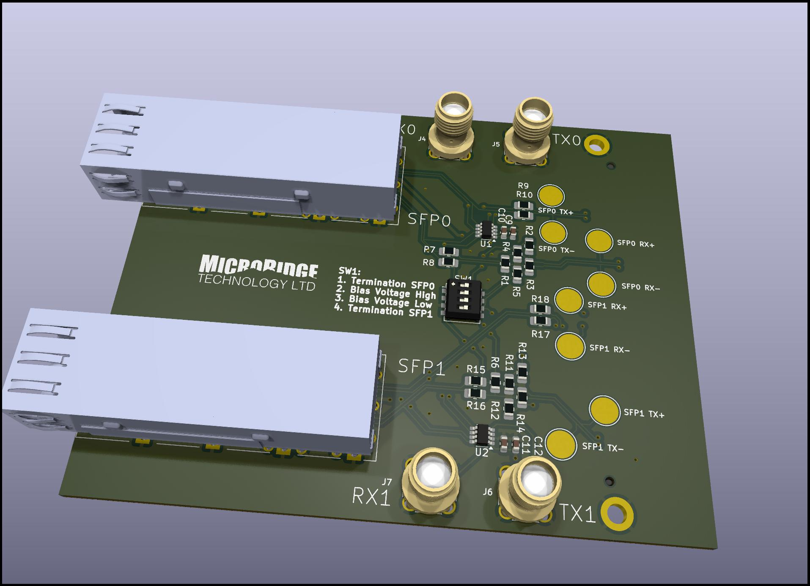

# FMC SFP Card

This project is designed to allow using sfp cables with the LVDS pins of an FPGA as opposed to the GTX pins. It provides testpoints to monitor the lvds signals with an oscilliscope.

# Pins Used

| FMC Pin | Logical Name | SFP Channel |
| ------- | ------------ | ----------- |
| D14     | FMC\_LA09\_P | SFP0 rx+    |
| D15     | FMC\_LA09\_N | SFP0 rx-    |
| H7      | FMC\_LA02\_P | SFP0 tx+    |
| H8      | FMC\_LA02\_N | SFP0 tx-    |
| H22     | FMC\_LA19\_P | SFP1 rx+    |
| H23     | FMC\_LA19\_N | SFP1 rx-    |
| H37     | FMC\_LA32\_P | SFP1 tx+    |
| H38     | FMC\_LA32\_N | SFP1 tx-    |

# Schematics
Schmatics are available [here](doc/fmc-sfp.pdf)

# Images

Top

Bottom

# Limitations 

This board is designed to work with low frequency signals (<200MHz)  GHz+ signals will certainly fail.
